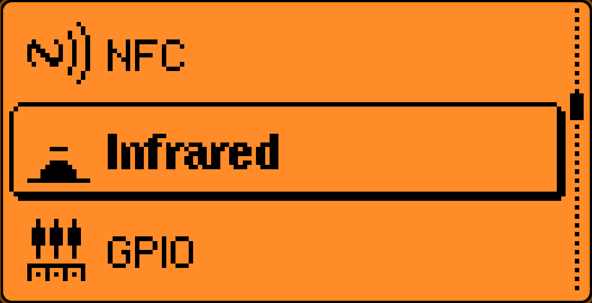
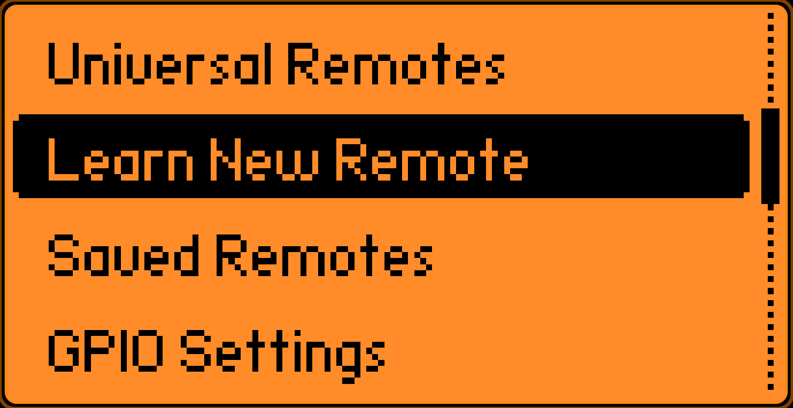
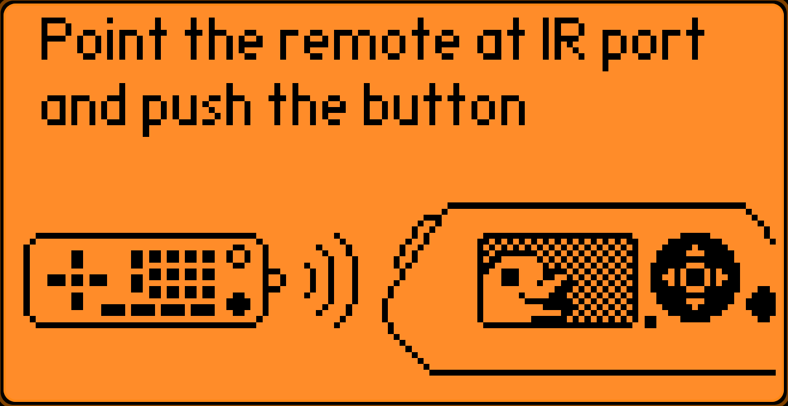
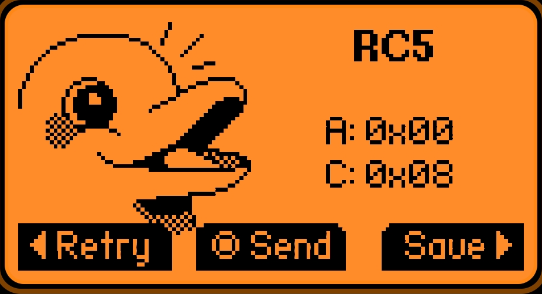
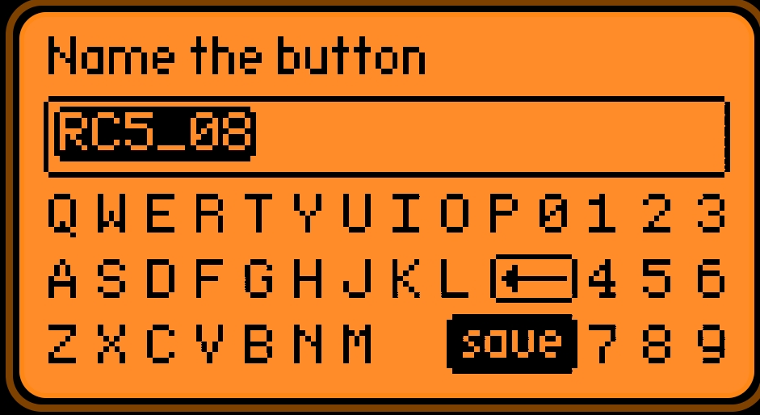
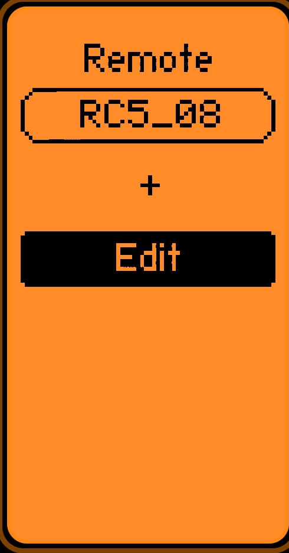

# Flipper Zero IR controllers

This repository contains a collection of **infrared (IR) scripts and configurations** for the **Flipper Zero** device.

The project focuses on collecting all IR-controlled devices. 

## 🚀 Installation

1. Clone this repository:
   ```
   git clone https://github.com/TONYIVCZ1/Flipper-Zero-IR.git
   ```

2. Copy the IR files to your Flipper Zero:
   - Using qFlipper  
   - Or directly into microSD card 

   Path on Flipper:
   ```
   /infrared/
   ```

3. Safely eject the device and enjoying.

---

## ⚠️ Disclaimer

This project is intended **as backuping and storing IR codes when you lost or broke your IR remote control**.  
Use it responsibly and only with devices you own or have permission to test.

---

## 🤝 Contributing

Contributions are welcome!  
Feel free to:
- Add new IR files  
- Improve documentation  
- Submit fixes or enhancements  

Just open a pull request or issue.

---
## ⭐ Acknowledgements

- Flipper Zero community  
- Open-source contributors and researchers  

---

## How create your own IR controller: 

   - 1) Go to Infrared 
   - 2) Select Learn New Remote
   - 3) Point IR LED on your remote controller in black box in Flipper Zero and press any button
   - 4) Press Save (Right)
   - 5) Name button
   - 6) Press +
   - 7) Repeat 3-7 for all buttons on your controller

   
   
   
   
   
   
   
